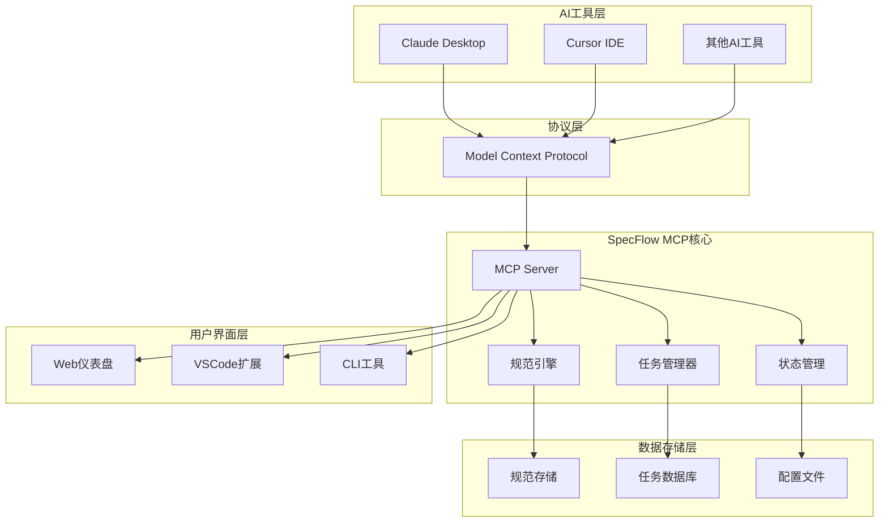
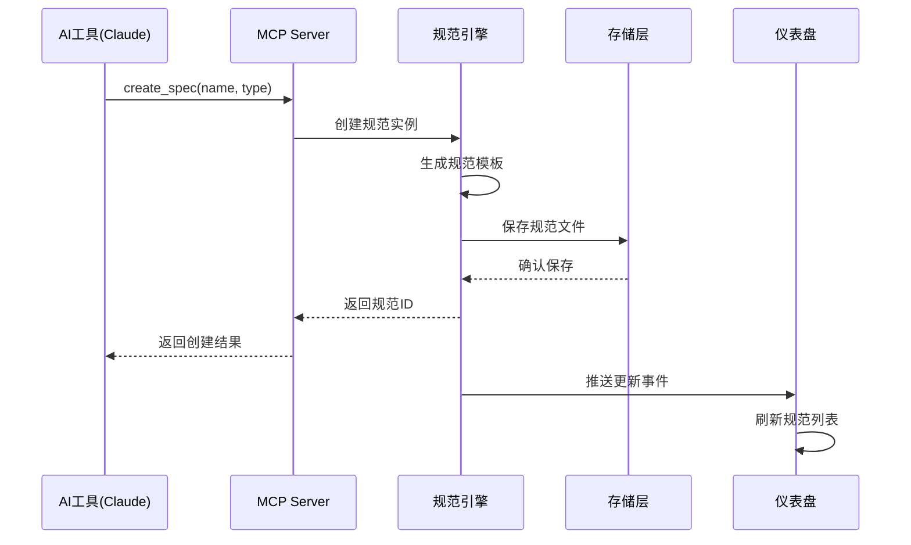
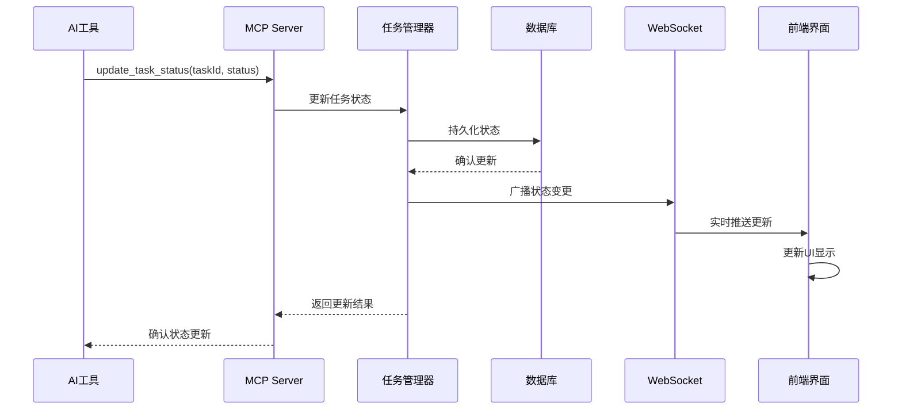

# 系统架构

SpecFlow MCP 采用现代化的微服务架构，通过模块化设计实现高可用性和可扩展性。

## 🏗️ 整体架构



## 📦 模块设计

### 1. 核心模块 (@specflow/spec-workflow-core)

**职责**：提供核心业务逻辑和共享功能

```typescript
// 核心功能模块
├── src/
│   ├── path-utils.ts      // 路径处理工具
│   ├── session-manager.ts // 会话管理
│   ├── task-parser.ts     // 任务解析器
│   ├── spec-engine.ts     // 规范引擎
│   └── types.ts           // 类型定义
```

**关键特性**：
- 🔧 规范解析和验证
- 📋 任务状态管理  
- 🔄 生命周期控制
- 📊 数据模型定义

### 2. MCP服务器 (@specflow/spec-workflow-mcp)

**职责**：Model Context Protocol 服务器实现

```typescript  
// MCP服务器结构
├── src/
│   ├── server.ts          // MCP服务器主逻辑
│   ├── tools/             // MCP工具实现
│   │   ├── spec-tools.ts  // 规范操作工具
│   │   ├── task-tools.ts  // 任务管理工具
│   │   └── status-tools.ts// 状态查询工具
│   └── types.ts           // MCP类型定义
```

**MCP工具清单**：
- `create_spec`: 创建新规范
- `list_specs`: 列出所有规范
- `update_task_status`: 更新任务状态
- `get_spec_progress`: 获取规范进度
- `validate_spec`: 验证规范完整性

### 3. Web仪表盘

#### 后端 (@specflow/dashboard-backend)
```typescript
├── src/
│   ├── server.ts          // Fastify服务器
│   ├── routes/            // API路由
│   │   ├── specs.ts       // 规范API
│   │   ├── tasks.ts       // 任务API
│   │   └── stats.ts       // 统计API
│   ├── watcher.ts         // 文件监控
│   └── websocket.ts       // WebSocket推送
```

#### 前端 (@specflow/dashboard-frontend)  
```tsx
├── src/
│   ├── components/        // React组件
│   │   ├── SpecCard.tsx   // 规范卡片
│   │   ├── TaskList.tsx   // 任务列表
│   │   └── ProgressChart.tsx // 进度图表
│   ├── pages/             // 页面组件
│   ├── hooks/             // 自定义Hook
│   └── store/             // 状态管理
```

### 4. VSCode扩展 (@specflow/vscode-extension)

```typescript
├── src/
│   ├── extension.ts       // 扩展入口
│   ├── providers/         // VSCode提供者
│   │   ├── spec-provider.ts    // 规范树视图
│   │   ├── task-provider.ts    // 任务面板
│   │   └── status-provider.ts  // 状态栏
│   └── commands/          // VSCode命令
```

## 🔄 数据流架构

### 规范创建流程



### 任务状态更新流程



## 🗄️ 数据存储设计

### 文件系统结构
```
project-root/
├── .specflow/
│   ├── config.json        // 配置文件
│   ├── specs/             // 规范存储
│   │   ├── user-auth.md   // 规范文档
│   │   └── payment.md
│   ├── tasks/             // 任务数据
│   │   ├── tasks.json     // 任务状态
│   │   └── history.json   // 历史记录
│   └── cache/             // 缓存数据
│       ├── spec-cache.json
│       └── task-cache.json
```

### 数据模型

#### 规范模型 (Spec)
```typescript
interface Spec {
  id: string;
  name: string;
  type: 'feature' | 'service' | 'component';
  status: 'draft' | 'review' | 'approved' | 'implemented';
  requirements: Requirement[];
  design: Design;
  tasks: Task[];
  createdAt: Date;
  updatedAt: Date;
  metadata: SpecMetadata;
}
```

#### 任务模型 (Task)  
```typescript
interface Task {
  id: string;
  specId: string;
  title: string;
  description: string;
  type: 'frontend' | 'backend' | 'database' | 'testing';
  status: 'pending' | 'in_progress' | 'completed' | 'blocked';
  priority: 'low' | 'medium' | 'high' | 'critical';
  assignee?: string;
  estimatedHours: number;
  actualHours?: number;
  dependencies: string[];
  createdAt: Date;
  updatedAt: Date;
}
```

## 🚀 性能优化

### 缓存策略
- **内存缓存**：规范和任务数据的热点缓存
- **文件缓存**：解析结果的本地缓存
- **增量更新**：只同步变更的数据

### 并发处理
- **异步IO**：所有文件操作使用异步模式
- **事件队列**：任务状态变更的异步处理
- **WebSocket池**：复用连接降低开销

### 扩展性设计
```typescript
// 插件系统接口
interface SpecFlowPlugin {
  name: string;
  version: string;
  initialize(context: PluginContext): Promise<void>;
  onSpecCreated(spec: Spec): Promise<void>;
  onTaskUpdated(task: Task): Promise<void>;
}

// 支持第三方扩展
const pluginManager = new PluginManager();
await pluginManager.load('custom-validator-plugin');
```

## 🔐 安全架构

### 认证授权
- **API密钥**：MCP服务器访问控制
- **会话管理**：Web仪表盘用户会话
- **权限控制**：基于角色的访问控制

### 数据安全
- **输入验证**：严格的参数校验
- **路径安全**：防止目录遍历攻击
- **文件权限**：最小权限原则

## 🔧 配置管理

### 环境配置
```json
{
  "server": {
    "port": 3000,
    "host": "localhost"
  },
  "mcp": {
    "tools": ["spec", "task", "status"],
    "maxConcurrentRequests": 10
  },
  "storage": {
    "type": "filesystem",
    "location": "./.specflow"
  },
  "features": {
    "dashboard": true,
    "vscode": true,
    "ai_assistant": true
  }
}
```

### 动态配置
- **热重载**：配置变更无需重启
- **环境变量**：支持环境变量覆盖
- **配置校验**：启动时验证配置完整性

## 📊 监控体系

### 性能指标
- **响应时间**：MCP工具调用延迟
- **吞吐量**：每秒处理的请求数
- **内存使用**：服务器内存占用情况
- **磁盘IO**：文件读写性能

### 业务指标  
- **规范数量**：创建的规范总数
- **任务完成率**：已完成任务占比
- **用户活跃度**：日活跃用户数
- **错误率**：系统错误发生频率

## 🔮 未来架构演进

### 微服务化
- 将核心功能拆分为独立服务
- 支持水平扩展和高可用部署
- 引入服务网格管理通信

### 云原生化
- Docker容器化部署
- Kubernetes集群管理
- 云存储和数据库集成

### AI能力增强
- 集成更多AI模型
- 智能推荐和自动化
- 自然语言接口优化

---

这个架构设计确保了SpecFlow MCP的可扩展性、可维护性和高性能，为AI规范驱动开发提供了坚实的技术基础。