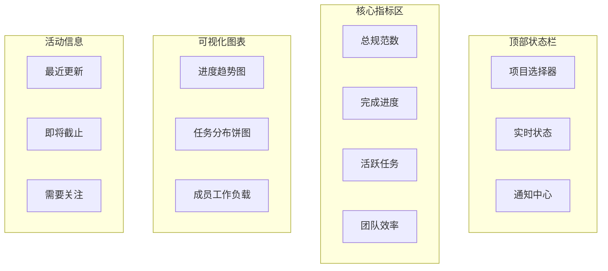

# Web仪表盘

SpecFlow MCP Web仪表盘是项目管理和进度监控的可视化中心，为团队提供实时的规范执行洞察。

## 🎯 功能概览

### 🏠 主仪表盘
- 📊 **项目概览**：一目了然的项目健康状态
- 📈 **进度图表**：可视化的完成度跟踪
- 🔥 **关键指标**：重要KPI的实时监控
- ⚡ **最近活动**：最新的规范和任务动态

### 📋 规范管理
- 📝 **规范列表**：所有规范的统一视图
- 🔍 **智能筛选**：按状态、类型、时间筛选
- 📄 **内容预览**：规范文档的在线查看
- ✏️ **编辑功能**：支持在线编辑和更新

### ✅ 任务跟踪
- 📌 **任务看板**：看板式任务管理
- 👤 **成员分配**：任务指派和协作
- ⏰ **时间跟踪**：工时记录和分析
- 🔗 **依赖关系**：任务间依赖的可视化

## 🚀 快速开始

### 启动仪表盘

```bash
# 启动包含仪表盘的完整服务
specflow-mcp start --with-dashboard

# 仅启动仪表盘（需要MCP Server已运行）
specflow-mcp dashboard

# 指定端口启动
specflow-mcp start --with-dashboard --port 8080
```

启动成功后访问：`http://localhost:3000`

### 首次配置

1. **项目设置**
   - 设置项目名称和描述
   - 配置团队成员信息
   - 选择规范模板和工作流

2. **集成配置**
   - 连接Git仓库（可选）
   - 设置通知方式
   - 配置自动化规则

## 🎨 界面导览

### 主导航栏

```
┌─────────────────────────────────────────────────────┐
│ 🏠 首页 │ 📋 规范 │ ✅ 任务 │ 📊 分析 │ ⚙️ 设置 │
└─────────────────────────────────────────────────────┘
```

### 📊 主仪表盘布局



### 📋 规范管理界面

#### 规范列表视图
```
┌─────────────────────────────────────────────────────┐
│ 🔍 搜索框          │ 筛选 ▼ │ 排序 ▼ │ + 新建     │
├─────────────────────────────────────────────────────┤
│ 📄 user-authentication    │ 🟢 已完成 │ 2024-01-15 │
│ 📄 payment-system        │ 🟡 进行中 │ 2024-01-14 │  
│ 📄 notification-service  │ 🔵 草稿   │ 2024-01-13 │
└─────────────────────────────────────────────────────┘
```

#### 规范详情视图
- **基本信息**：名称、类型、状态、创建时间
- **进度概览**：完成百分比、任务分布
- **需求列表**：结构化需求展示
- **设计文档**：技术设计的富文本展示
- **任务清单**：关联任务的详细列表
- **活动时间线**：历史变更记录

### ✅ 任务管理界面

#### 看板视图
```
┌─────────┬─────────┬─────────┬─────────┐
│ 📋 待处理 │ 🔄 进行中 │ ✅ 已完成 │ 🚫 阻塞 │
├─────────┼─────────┼─────────┼─────────┤
│ 任务A    │ 任务D   │ 任务G   │ 任务J   │
│ 任务B    │ 任务E   │ 任务H   │         │
│ 任务C    │ 任务F   │ 任务I   │         │
└─────────┴─────────┴─────────┴─────────┘
```

#### 列表视图
- 📋 **任务标题**：可点击查看详情
- 👤 **指派人**：头像和姓名显示
- 🎯 **优先级**：彩色标签标识
- ⏰ **截止时间**：倒计时提醒
- 📊 **进度**：百分比进度条
- 🏷️ **标签**：分类标签

## 🛠️ 高级功能

### 📊 数据分析

#### 进度分析
```javascript
// 进度趋势图配置
{
  type: 'line',
  data: {
    labels: ['Week 1', 'Week 2', 'Week 3', 'Week 4'],
    datasets: [{
      label: '完成进度',
      data: [20, 45, 70, 85],
      borderColor: '#3b82f6'
    }]
  }
}
```

#### 团队效率分析
- 👥 **成员贡献**：各成员任务完成情况
- ⏱️ **工时分布**：时间投入的分析
- 📈 **效率趋势**：团队效率的变化
- 🎯 **瓶颈识别**：找出影响进度的问题

### 🔔 智能通知

#### 通知类型
- 📝 **规范变更**：规范创建、更新通知
- ✅ **任务更新**：状态变更、指派通知  
- ⏰ **截止提醒**：任务临近截止提醒
- 🚨 **异常警告**：进度延迟、阻塞任务

#### 通知渠道
```json
{
  "notifications": {
    "email": {
      "enabled": true,
      "smtp": {
        "host": "smtp.gmail.com",
        "port": 587,
        "secure": false
      }
    },
    "webhook": {
      "enabled": true,
      "url": "https://hooks.slack.com/...",
      "events": ["task_completed", "spec_approved"]
    },
    "browser": {
      "enabled": true,
      "permission": "granted"
    }
  }
}
```

### 🎨 自定义配置

#### 主题设置
```css
/* 自定义主题变量 */
:root {
  --primary-color: #3b82f6;
  --success-color: #10b981;
  --warning-color: #f59e0b;
  --error-color: #ef4444;
  --background-color: #f8fafc;
}
```

#### 仪表盘布局
- 📱 **响应式设计**：适配各种屏幕尺寸
- 🎛️ **组件拖拽**：自定义仪表盘布局
- 📋 **快捷面板**：常用功能快速访问
- 🎯 **个性化设置**：用户个人偏好配置

## 🔗 集成功能

### Git集成

```bash
# 配置Git仓库
specflow-mcp config set git.remote "https://github.com/user/repo.git"
specflow-mcp config set git.branch "main"

# 启用自动同步
specflow-mcp config set git.autoSync true
```

功能特性：
- 🔄 **自动同步**：规范变更自动提交
- 📝 **提交信息**：智能生成提交消息
- 🔀 **分支管理**：支持特性分支工作流
- 📊 **变更跟踪**：可视化文件变更历史

### CI/CD集成

#### GitHub Actions
```yaml
name: SpecFlow Validation
on: 
  push:
    paths: ['.specflow/**']

jobs:
  validate:
    runs-on: ubuntu-latest
    steps:
      - uses: actions/checkout@v2
      - name: Validate Specs
        run: |
          npm install -g @specflow/spec-workflow-mcp
          specflow-mcp validate --all
          specflow-mcp report --format json > validation-report.json
      - name: Update Dashboard
        run: |
          curl -X POST ${{ secrets.SPECFLOW_WEBHOOK }} \
            -H "Content-Type: application/json" \
            -d @validation-report.json
```

### 第三方工具集成

#### Slack集成
```json
{
  "integrations": {
    "slack": {
      "webhook": "https://hooks.slack.com/services/...",
      "channel": "#development",
      "events": [
        "spec_created",
        "task_completed",
        "milestone_reached"
      ]
    }
  }
}
```

#### Jira同步
- 🔗 **双向同步**：SpecFlow任务与Jira issue同步
- 🏷️ **状态映射**：状态自动转换
- 📊 **进度汇报**：自动更新Jira进度

## 📱 移动端体验

### 响应式设计
```css
/* 移动端适配 */
@media (max-width: 768px) {
  .dashboard-grid {
    grid-template-columns: 1fr;
    gap: 1rem;
  }
  
  .sidebar {
    transform: translateX(-100%);
    position: fixed;
  }
  
  .main-content {
    padding: 1rem;
  }
}
```

### PWA功能
- 📱 **离线访问**：关键数据离线可用
- 🔔 **推送通知**：重要更新推送提醒
- 🏠 **添加到主屏**：类原生应用体验

## ⚙️ 配置管理

### 仪表盘配置文件

```json
{
  "dashboard": {
    "title": "SpecFlow项目管理",
    "theme": "light",
    "language": "zh-CN",
    "widgets": [
      {
        "type": "progress-chart",
        "position": { "x": 0, "y": 0, "w": 6, "h": 4 },
        "config": { "showTrend": true }
      },
      {
        "type": "task-summary",
        "position": { "x": 6, "y": 0, "w": 6, "h": 4 },
        "config": { "groupBy": "status" }
      }
    ],
    "filters": {
      "defaultSpec": "all",
      "defaultTimeRange": "30d"
    }
  }
}
```

### 用户权限配置

```json
{
  "roles": {
    "admin": {
      "permissions": ["read", "write", "delete", "admin"]
    },
    "developer": {
      "permissions": ["read", "write"]
    },
    "viewer": {
      "permissions": ["read"]
    }
  },
  "users": [
    {
      "id": "user1",
      "name": "张三",
      "role": "admin",
      "email": "zhang@example.com"
    }
  ]
}
```

## 🚀 性能优化

### 前端优化
- ⚡ **虚拟滚动**：大列表性能优化
- 💾 **智能缓存**：数据缓存策略
- 🔄 **增量更新**：只更新变更部分
- 📦 **代码分割**：按需加载组件

### 后端优化  
- 🔗 **WebSocket**：实时数据推送
- 📊 **数据聚合**：预计算统计数据
- 🗂️ **索引优化**：快速数据查询
- 💨 **响应压缩**：减少传输数据量

## 🐛 故障排除

### 常见问题

**问题1：仪表盘无法访问**
```bash
# 检查服务状态
curl http://localhost:3000/health

# 检查防火墙设置
sudo ufw status

# 重启仪表盘服务
specflow-mcp restart --dashboard-only
```

**问题2：数据不更新**
```bash
# 检查WebSocket连接
specflow-mcp debug websocket

# 清除缓存
specflow-mcp cache clear

# 强制刷新数据
specflow-mcp sync --force
```

**问题3：性能缓慢**
```bash
# 查看性能指标
specflow-mcp metrics --dashboard

# 优化数据库
specflow-mcp optimize --database

# 清理历史数据
specflow-mcp cleanup --older-than 90d
```

---

通过SpecFlow MCP Web仪表盘，您可以实时掌控项目进展，让规范驱动开发变得可视化、可管理、可优化。