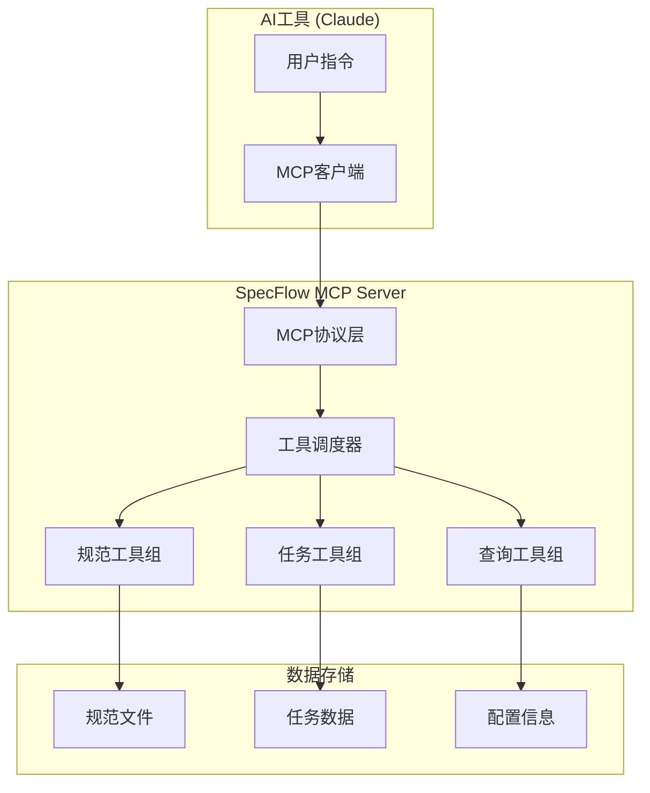

# MCP Server

SpecFlow MCP Server 是基于 Model Context Protocol 的核心服务，为AI工具提供结构化的规范驱动开发能力。

## 🔌 MCP协议简介

Model Context Protocol (MCP) 是由 Anthropic 开发的开放协议，用于AI助手与外部工具和数据源的安全交互。SpecFlow MCP Server 实现了这一协议，使得Claude等AI工具能够：

- 📋 管理项目规范和需求
- ✅ 跟踪任务状态和进度
- 🔄 维护开发工作流的一致性
- 📊 提供项目洞察和分析

## 🏗️ MCP工具架构



## 🛠️ 可用工具清单

### 规范管理工具

#### `create_spec` - 创建规范
创建新的项目规范文档。

**参数：**
```typescript
{
  name: string;           // 规范名称，如 "user-authentication"
  type: 'feature' | 'service' | 'component'; // 规范类型
  description?: string;   // 可选描述
  template?: string;      // 可选模板名称
}
```

**使用示例：**
```markdown
请创建一个名为"payment-system"的服务规范，用于处理用户支付功能
```

**返回结果：**
```json
{
  "success": true,
  "spec": {
    "id": "payment-system-001",
    "name": "payment-system",
    "type": "service",
    "status": "draft",
    "createdAt": "2024-01-15T10:30:00Z",
    "filePath": ".specflow/specs/payment-system.md"
  }
}
```

#### `list_specs` - 列出规范
获取所有项目规范的列表和状态。

**参数：**
```typescript
{
  status?: 'draft' | 'review' | 'approved' | 'implemented'; // 可选状态筛选
  type?: 'feature' | 'service' | 'component';              // 可选类型筛选  
  limit?: number;     // 可选返回数量限制
}
```

**使用示例：**
```markdown
显示所有已批准的服务规范
```

#### `get_spec` - 获取规范详情
获取指定规范的完整信息。

**参数：**
```typescript
{
  specId: string;     // 规范ID或名称
  includeContent?: boolean; // 是否包含完整内容
}
```

#### `update_spec` - 更新规范
更新规范的状态或内容。

**参数：**
```typescript
{
  specId: string;
  status?: 'draft' | 'review' | 'approved' | 'implemented';
  content?: string;   // 新的规范内容
}
```

### 任务管理工具

#### `update_task_status` - 更新任务状态
更新指定任务的状态和相关信息。

**参数：**
```typescript
{
  taskId: string;     // 任务ID
  status: 'pending' | 'in_progress' | 'completed' | 'blocked';
  actualHours?: number;      // 实际耗时
  notes?: string;           // 更新备注
  assignee?: string;        // 指派人
}
```

**使用示例：**
```markdown
将"实现用户登录API"任务标记为已完成，实际用时3小时
```

#### `create_task` - 创建任务
为规范创建新的开发任务。

**参数：**
```typescript
{
  specId: string;           // 所属规范ID
  title: string;            // 任务标题
  description?: string;     // 任务描述
  type: 'frontend' | 'backend' | 'database' | 'testing';
  priority: 'low' | 'medium' | 'high' | 'critical';
  estimatedHours?: number;  // 预估工时
  dependencies?: string[];  // 依赖任务ID列表
}
```

#### `list_tasks` - 列出任务
获取任务列表，支持多种筛选条件。

**参数：**
```typescript
{
  specId?: string;          // 指定规范
  status?: string;          // 任务状态
  assignee?: string;        // 指派人
  type?: string;            // 任务类型
}
```

### 查询工具

#### `get_spec_progress` - 获取规范进度
获取指定规范的完成进度和统计信息。

**参数：**
```typescript
{
  specId: string;           // 规范ID
  includeDetails?: boolean; // 是否包含详细任务信息
}
```

**返回结果：**
```json
{
  "success": true,
  "progress": {
    "specId": "user-auth-001",
    "specName": "user-authentication",
    "total": 12,
    "completed": 8,
    "inProgress": 2,
    "pending": 2,
    "blocked": 0,
    "percentage": 66.67,
    "estimatedCompletion": "2024-01-20T16:00:00Z"
  }
}
```

#### `validate_spec` - 验证规范
检查规范的完整性和有效性。

**参数：**
```typescript
{
  specId: string;           // 规范ID
  strict?: boolean;         // 是否严格验证
}
```

#### `search_specs` - 搜索规范
在规范内容中进行全文搜索。

**参数：**
```typescript
{
  query: string;            // 搜索关键词
  type?: string;            // 规范类型筛选
  includeContent?: boolean; // 是否返回匹配内容片段
}
```

## 🔧 配置和启动

### 基础配置

在项目根目录创建 `.specflow/config.json`：

```json
{
  "mcp": {
    "server": {
      "name": "specflow-mcp",
      "version": "1.0.0"
    },
    "tools": {
      "enabled": ["create_spec", "list_specs", "update_task_status"],
      "timeout": 30000,
      "concurrency": 5
    },
    "storage": {
      "type": "filesystem",
      "path": "./.specflow"
    }
  }
}
```

### 启动MCP Server

```bash
# 启动基础MCP服务
specflow-mcp start

# 启动并开启调试模式
specflow-mcp start --debug

# 指定配置文件启动
specflow-mcp start --config custom-config.json
```

## 🔗 Claude集成配置

### 1. Claude Desktop配置

在Claude Desktop的配置文件中添加：

**macOS:** `~/Library/Application Support/Claude/claude_desktop_config.json`

```json
{
  "mcpServers": {
    "specflow": {
      "command": "node",
      "args": ["/path/to/specflow-mcp/dist/index.js"],
      "env": {
        "SPECFLOW_PROJECT_ROOT": "/path/to/your/project"
      }
    }
  }
}
```

### 2. 环境变量

```bash
# 项目根目录
export SPECFLOW_PROJECT_ROOT="/path/to/project"

# 启用详细日志
export SPECFLOW_LOG_LEVEL="debug"

# 自定义存储路径
export SPECFLOW_STORAGE_PATH="./.specflow"
```

## 🧪 MCP工具测试

### 连接状态测试

在Claude中输入：
```markdown
请列出当前可用的MCP工具
```

预期看到SpecFlow相关工具列表。

### 功能测试脚本

```bash
# 测试规范创建
echo '{"name": "test-spec", "type": "feature"}' | \
  specflow-mcp test create_spec

# 测试规范列表  
specflow-mcp test list_specs '{}'

# 测试任务状态更新
echo '{"taskId": "task-001", "status": "completed"}' | \
  specflow-mcp test update_task_status
```

## 📊 性能和监控

### 工具调用统计

```json
{
  "tools": {
    "create_spec": {"calls": 45, "avgTime": "120ms", "errors": 0},
    "list_specs": {"calls": 128, "avgTime": "35ms", "errors": 1},
    "update_task_status": {"calls": 67, "avgTime": "28ms", "errors": 0}
  },
  "server": {
    "uptime": "5h 32m",
    "memoryUsage": "45MB",
    "activeConnections": 2
  }
}
```

### 监控命令

```bash
# 查看服务状态
specflow-mcp status

# 查看实时日志
specflow-mcp logs --follow

# 查看性能指标
specflow-mcp metrics
```

## 🔐 安全考虑

### 权限控制

```json
{
  "security": {
    "allowedPaths": ["/project", "/workspace"],
    "deniedPaths": ["/system", "/etc"],
    "maxFileSize": "10MB",
    "enableSandbox": true
  }
}
```

### 访问限制

- 🔒 只能访问配置的项目目录
- 📂 禁止系统敏感目录访问
- 🔍 输入参数严格验证
- ⏱️ 超时保护防止资源占用

## 🐛 故障排除

### 常见问题

**问题1：MCP连接失败**
```bash
# 检查服务是否运行
ps aux | grep specflow-mcp

# 检查端口占用
netstat -an | grep 3000

# 重启服务
specflow-mcp restart
```

**问题2：工具调用超时**
```bash
# 增加超时配置
export SPECFLOW_TOOL_TIMEOUT=60000

# 检查文件权限
ls -la .specflow/
```

**问题3：规范文件损坏**
```bash
# 验证规范文件
specflow-mcp validate --all

# 修复损坏文件
specflow-mcp repair --spec user-auth
```

### 调试模式

```bash
# 启用详细日志
export SPECFLOW_DEBUG=true

# 查看MCP通信日志
specflow-mcp logs --level debug --filter mcp
```

## 📈 扩展开发

### 自定义MCP工具

```typescript
// 注册自定义工具
import { MCPServer } from '@specflow/spec-workflow-mcp';

const server = new MCPServer();

server.addTool({
  name: 'custom_analyzer',
  description: '自定义代码分析工具',
  inputSchema: {
    type: 'object',
    properties: {
      filePath: { type: 'string' },
      options: { type: 'object' }
    }
  },
  handler: async (input) => {
    // 自定义逻辑实现
    return { analysis: 'result' };
  }
});
```

### 工具插件系统

```typescript
// 插件接口
interface MCPToolPlugin {
  name: string;
  tools: MCPTool[];
  initialize(): Promise<void>;
  cleanup(): Promise<void>;
}

// 加载插件
await server.loadPlugin(new CustomAnalysisPlugin());
```

---

通过SpecFlow MCP Server，AI工具能够深度理解和参与您的规范驱动开发流程，实现真正的智能协作。