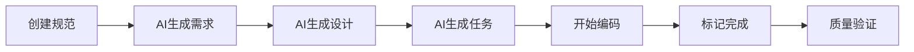

# 快速开始

通过本指南，您将学会如何在10分钟内开始使用SpecFlow MCP进行AI规范驱动开发。

## 🎯 第一个规范

### 1. 启动服务

```bash
# 启动 SpecFlow MCP 服务
specflow-mcp start --with-dashboard

# 服务启动后会显示：
# ✅ SpecFlow MCP Server running on port 3000
# 📊 Dashboard available at http://localhost:3000
# 🔌 MCP Server ready for Claude connection
```

### 2. 在Claude中创建规范

在Claude中输入以下指令：

```
创建一个名为"user-authentication"的规范
```

Claude会引导您完成规范创建流程：

#### 📋 需求阶段 (Requirements)
```markdown
## 需求规范

### 功能需求
- 用户可以通过邮箱和密码注册账户
- 用户可以登录和登出
- 支持找回密码功能
- 实现会话管理

### 非功能需求  
- 密码必须加密存储
- 登录失败3次后锁定账户
- 会话过期时间为24小时
```

#### 🎨 设计阶段 (Design)
```markdown
## 技术设计

### 数据库设计
- users 表：id, email, password_hash, created_at, locked_at
- sessions 表：id, user_id, token, expires_at

### API 设计
- POST /api/auth/register
- POST /api/auth/login  
- POST /api/auth/logout
- POST /api/auth/forgot-password

### 安全策略
- 使用 bcrypt 加密密码
- JWT token 进行会话管理
- 实现 rate limiting
```

#### ✅ 任务阶段 (Tasks)
```markdown
## 开发任务

### 后端任务
1. 创建用户数据模型
2. 实现密码加密逻辑
3. 开发注册接口
4. 开发登录接口
5. 实现JWT中间件
6. 添加账户锁定机制

### 前端任务  
1. 设计登录表单组件
2. 设计注册表单组件
3. 实现表单验证
4. 集成API调用
5. 添加错误处理
6. 实现自动登录
```

### 3. 查看仪表盘

打开浏览器访问 `http://localhost:3000`，您将看到：

- 📊 **规范概览**：显示所有规范的状态
- 📈 **进度跟踪**：实时更新的完成进度
- 🔍 **任务详情**：每个任务的详细信息
- 📝 **AI对话记录**：与AI的交互历史

## 🔄 开发工作流

### 标准工作流程



### 在Claude中执行任务

选择一个任务开始开发：

```
帮我实现 user-authentication 规范中的"创建用户数据模型"任务
```

Claude会：
1. 📖 读取相关规范内容
2. 🎯 理解任务具体要求
3. 💻 生成相应代码
4. ✅ 标记任务状态

### 任务状态管理

```
# 查看所有规范
列出我的所有规范

# 查看特定规范状态
显示 user-authentication 规范的进度

# 更新任务状态
将"创建用户数据模型"任务标记为已完成
```

## 🛠️ VSCode 集成

### 安装扩展

1. 在VSCode中安装 "SpecFlow MCP" 扩展
2. 重启VSCode
3. 在侧边栏查看SpecFlow面板

### 扩展功能

- **规范浏览器**：在编辑器中直接查看规范
- **任务管理**：标记任务完成状态
- **进度监控**：实时查看项目进度
- **快速跳转**：从代码跳转到对应规范

## 🎨 高级用法

### 自定义规范模板

```bash
# 创建自定义模板
specflow-mcp template create --name "microservice" --type "backend-service"

# 使用模板创建规范
specflow-mcp spec create --template "microservice" --name "payment-service"
```

### 团队协作

```bash
# 导出规范
specflow-mcp export --spec "user-authentication" --format json

# 导入规范
specflow-mcp import --file "user-authentication.json"

# 生成报告
specflow-mcp report --type progress --output pdf
```

### 与CI/CD集成

在 `.github/workflows/specflow.yml` 中：

```yaml
name: SpecFlow Validation
on: [push, pull_request]

jobs:
  validate:
    runs-on: ubuntu-latest
    steps:
      - uses: actions/checkout@v2
      - name: Install SpecFlow
        run: npm install -g @specflow/spec-workflow-mcp
      - name: Validate Specs
        run: specflow-mcp validate --all
```

## 🏆 最佳实践

### 规范命名约定
- 使用 kebab-case：`user-authentication`
- 保持描述性：`payment-processing-service`
- 避免过长：最多3-4个单词

### 需求编写建议
- 使用EARS格式：`当[条件]时，系统应该[响应]`
- 保持原子性：每个需求只描述一个功能点
- 添加验收标准：明确的成功标准

### 任务拆分原则
- 单个任务不超过4小时工作量
- 任务间依赖关系清晰
- 包含具体的交付物描述

## 🚦 下一步

现在您已经掌握了SpecFlow MCP的基本用法，可以：

1. 📖 深入了解 [架构设计](/guide/architecture)
2. 🔧 探索 [MCP Server](/guide/mcp-server) 的高级功能
3. 📊 学习 [仪表盘](/guide/dashboard) 的所有特性
4. 📚 查看 [API文档](/api/) 进行定制开发

## 💡 小贴士

- 💬 **经常与AI交互**：不确定时就问Claude
- 📊 **定期查看仪表盘**：掌握项目整体进度  
- 🔄 **保持规范更新**：需求变更时及时更新规范
- 👥 **团队协作**：分享规范和进度给团队成员

---

恭喜！您已经开始了AI规范驱动开发之旅。记住：**好的规范是成功项目的基石**。